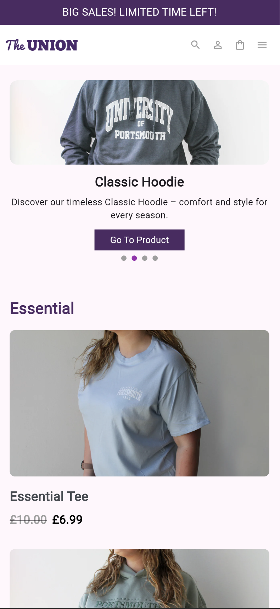
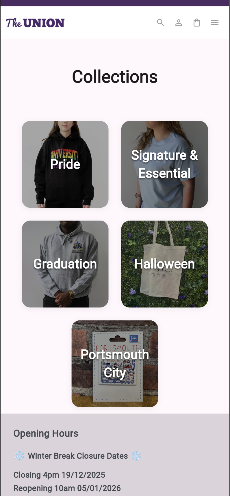
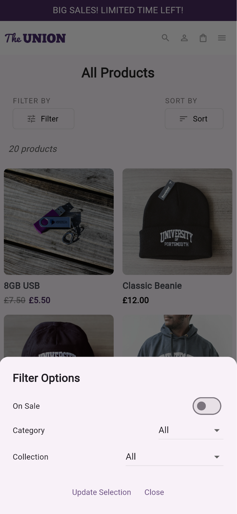
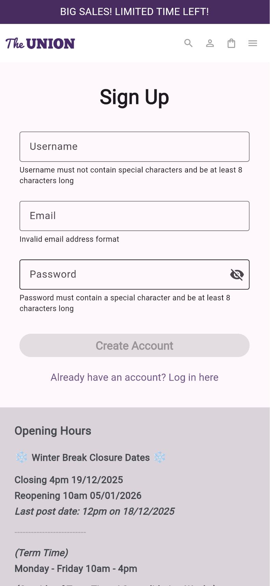

# Union Shop

## Description

Union Shop is a Flutter-based e-commerce application designed for university merchandise sales. The app allows users to browse, search, and purchase a variety of university-branded clothing and accessories. Key features include user authentication, product browsing, cart management, and secure checkout.

### Key Features
- Browse collections of university merchandise
- Search and filter products by category
- Add items to cart and manage orders
- User authentication and profile management
- Responsive UI for mobile and desktop
- Integration with Firebase for backend services

### Firebase Auth
Firebase Authentication is integrated to handle user sign up, login, and session management. The app uses the `firebase_auth` package to connect with Firebase, enabling secure email/password authentication. User authentication state is managed throughout the app, allowing users to register, log in, and log out. Protected routes and features (such as accessing the profile page) require authentication. Firebase configuration is initialized in `lib/firebase_options.dart`, and authentication logic is handled in the relevant view models and repositories.

**Key Usage:**
- Users can register and log in with email and password.
- Auth state is monitored to show the correct screens (login, home, profile, etc.).
- User data is securely managed via Firebase.

### Firestore Cart Persistence
The app uses Cloud Firestore to persist users' shopping cart data across sessions. The `cloud_firestore` package is integrated to enable real-time database operations. When a user adds or removes items from their cart, these changes are reflected in Firestore, ensuring that the cart state is always up to date—even after logout or on a different device. Cart data is associated with the authenticated user's UID, providing a seamless and personalized shopping experience.

**Key Usage:**
- Cart items are stored and retrieved from Firestore collections tied to each user.
- Updates to the cart (add, remove, clear) are synced in real time with Firestore.
- Cart persistence allows users to resume shopping after logging back in.

---

## Installation and Setup

### Prerequisites
- macOS, Windows, or Linux
- Flutter SDK (latest stable version)
- Dart SDK
- Git
- (Optional) Firebase CLI for backend setup

### Clone the Repository
```bash
git clone https://github.com/jaymckerracher/union_shop.git
cd union_shop
```

### Install Dependencies
```bash
flutter pub get
```

### Run the Project
```bash
flutter run
```
You can specify a device or platform with `-d` (e.g., `flutter run -d chrome` for web).

---

## Usage Instructions

### Main Features
- **Browse Products:** Navigate through categories and view product details.
- **Add to Cart:** Select items and add them to your shopping cart.
- **Checkout:** Complete your purchase.
- **Profile:** Manage your account and view order history.

### User Flows
1. Sign up or log in
2. Browse or search for products
3. Add desired items to cart
4. Proceed to checkout and complete payment
5. View order confirmation and history

### Configuration
- Firebase configuration is managed in `lib/firebase_options.dart`.
- Update assets in the `assets/images/` directory as needed.

### Running Tests
```bash
flutter test
```
Unit and widget tests are located in the `test/` directory.

### Screenshots






---

## Project Structure & Technologies

```
lib/
	main.dart                # App entry point
	views/                   # UI pages and widgets
	models/                  # Data models
	repositories/            # Data access logic
	utils/                   # Utility functions
	view_models/             # State management
assets/
	images/                  # Product images
test/
	views/                   # Widget tests
	utils/                   # Unit tests
firebase.json              # Firebase configuration
pubspec.yaml               # Dependencies
```

### Key Technologies
- Flutter & Dart
- Provider (state management)
- Firebase (auth, database)
- flutter_test (testing)

---

## Known Issues & Limitations

- Some features may require additional backend configuration
- Asset loading in tests may need mocking
- No active payment for checkout

### Future Improvements
- Add payment options
- Improve accessibility and UI/UX
- Expand product catalog
- Expand widget testing

---

## Contact Information

**Jay McKerracher**

- Email: jaymckerracher@gmail.com
- GitHub: [jaymckerracher](https://github.com/jaymckerracher)
